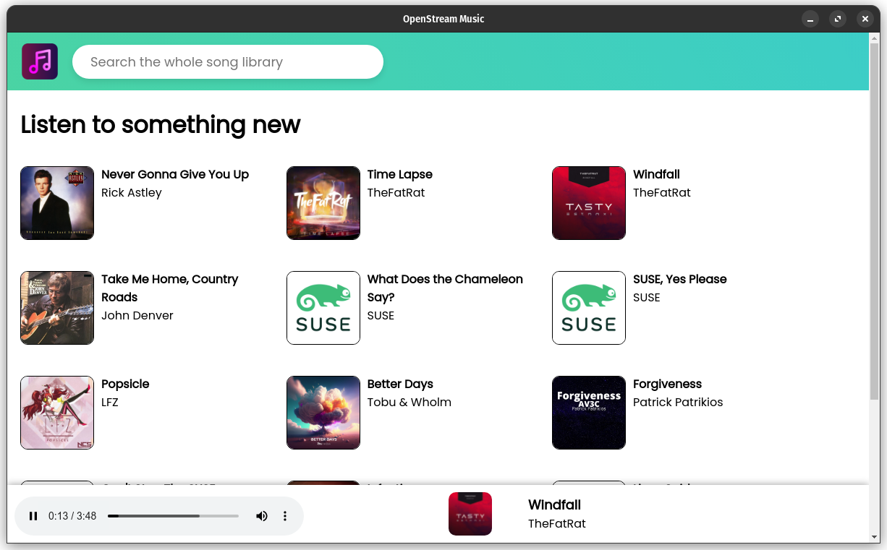

# OpenStream Music

OpenStream Music is a free streaming service designed to provide a seamless music listening experience without any ads, accounts, or paid plans. It aims to bring music lovers together by offering a wide range of songs from various genres, all available at your fingertips.

## Features

- **Ad-Free Listening:** Enjoy uninterrupted music playback without any advertisements, allowing you to immerse yourself in the music.
- **No Accounts or Sign-ups:** OpenStream Music does not require you to create an account or sign up, making it effortless to dive straight into discovering and streaming your favorite tunes.
- **Unlimited Access:** Explore a vast catalog of songs from different artists, genres, and eras, all accessible without any limitations.
- **Simple and Intuitive:** The user interface is designed to be user-friendly, making it easy to search for songs and navigate through the app effortlessly.

## Screenshots

*Explore the OpenStream Music app, search for songs, and enjoy uninterrupted music streaming.*

## System Requirements

OpenStream Music is designed to run on the following operating systems:

| Operating System | Supported Versions       |
|------------------|--------------------------|
| Windows          | 7, 8, 10, 11             |
| Linux            | AppImage, DEB, RPM       |
| Android          | Not available (No mobile app currently) |
| iOS              | Not available (No mobile app currently) |

Please note that OpenStream Music does not support macOS at this time.

## Installation

To install OpenStream Music on your system, follow these steps:

1. Visit the OpenStream Music website at [https://openstreamorg.github.io](https://openstreamorg.github.io).
2. Download the appropriate installation file for your operating system:
   - For Windows, download the Windows installer.
   - For Linux, choose the AppImage, DEB, or RPM package depending on your distribution.
3. Run the installer file and follow the on-screen instructions to complete the installation process.
4. Launch OpenStream Music after installation and start enjoying your favorite music instantly.

## Feedback and Support

We value your feedback and are always looking to improve OpenStream Music. If you have any suggestions, encounter any issues, or want to report a bug, please visit the OpenStream Music Discussions page on GitHub: [https://github.com/orgs/openstreamorg/discussions](https://github.com/orgs/openstreamorg/discussions).

## Development

OpenStream Music is an open-source project hosted on GitHub. If you are interested in contributing to the development of OpenStream Music, you can visit the GitHub repository: [https://github.com/openstreamorg](https://github.com/openstreamorg).

## License

OpenStream Music is released under the [GPL v2 License](https://github.com/openstreamorg/openstreammusic/blob/main/LICENSE).

We hope you enjoy using OpenStream Music and have a fantastic music streaming experience!

*Note: The screenshot and URLs provided in this document are for illustrative purposes only and may not represent the actual OpenStream Music service.*
